#<center>故障自愈第三方告警源接入开发实验手册</center>


# 一、实验概述
 蓝鲸平台提供了完善的运维解决方案，并且通过前后台开发框架、公共组件等模块，帮助业务的产品和技术人员快速构建低成本、免运维的支撑工具和运营系统。故障自愈通过自动化处理节省人力投入，通过预定的恢复流程让恢复过程更可靠，通过并行分析达到更快的故障定位和恢复。虽然故障自愈已集成了业界主流的监控系统，但是，你可能发现自己企业内使用的告警系统并没有对接故障自愈，从而导致你无法使用故障自愈。

腾讯云 TechWork《运维开发公开课》专场第4场，将邀请蓝鲸高级开发工程师，为你介绍故障自愈系统，学习第三方告警源接入，把企业内系统接入故障自愈中，在蓝鲸平台内整合各个系统能力，实现自动化实现故障定位和恢复。

# 二、准备工作
- 蓝鲸社区版环境及账号（培训方提供，不需要自己搭建）
- 蓝鲸应用开发环境（安装指南见蓝鲸开发者中心）
- 后台操作系统需要centos6.5以上版本
- 后台环境需要安装 redis, beanstalkd 
- 自己用起来顺手的 IDE，推荐 PyCharm

# 三、任务准备：搭建本地环境
#### 任务目标：在本地配置故障自愈的运行环境，能够将故障自愈的前端APP和后台在本地运行起来。

## 1.1 源码下载
将提供的源码**fta_open.tar.gz**包解压


## 1.2 配置本地 hosts
windows: 在 C:\Windows\System32\drivers\etc\host 文件中添加 `127.0.0.1 dev.paasce-poc.o.qcloud.com`。

mac: 执行 `sudo vim /etc/hosts`，添加 `127.0.0.1 dev.paasce-poc.o.qcloud.com`。

## Web安装部署：

## 1.3前端环境部署准备

### 1.3.1 前端开发依赖软件

* MySQL >= 5.5.24

请参看官方资料 [MySQL](https://dev.mysql.com/doc/mysql-getting-started/en/#mysql-getting-started-installing)

推荐版本下载： [MySQL 5.5+](https://dev.mysql.com/downloads/mysql/5.5.html#downloads)

## 1.4 前端部署
源码包含Web层和后台服务层两个部分，其中web_app是Web层根目录，在源码下载目录执行
`cd web_app`

### 1.4.1 数据库初始化

* 在 mysql 中创建名为 bk_fta_solutions 的数据库
```
CREATE DATABASE `bk_fta_solutions` DEFAULT CHARACTER SET utf8 COLLATE utf8_general_ci;
```

* 执行初始化sql 其中`your_user_name`需要替换为连接mysql的用户名
```
mysql -uyour_user_name -p  < sql/init_fta.sql
```

### 1.4.2 安装python依赖库
**安装 pip**
```
	curl https://bootstrap.pypa.io/get-pip.py -o get-pip.py
	python get-pip.py
```

**依赖库安装**

```
yum install \
    --skip-broken \
    --assumeyes \
    --quiet \
    "python-tools" \
    "python-devel"\
    "bzip2-devel" \
    "expat-devel" \
    "gettext-devel" \
    "libzip-devel" \
    "libcurl-devel" \
    "libxml2-devel" \
    "libffi-devel" \
    "mysql-devel" \
    "openssl" \
    "openssl-devel" \
    "readline-devel" \
    "sqlite-devel" \
    "zlib-devel" 
```


**安装其他依赖库**

```
    pip install -r requirements.txt
```

### 1.4.3 修改本地配置
进入到工程目录下

* 修改 ./project/conf/settings_env.py

> 请注意：以下列举变量必须要结合本地社区版的实际情况进行配置，否则故障自愈的大部分功能将无法使用

```python
# ==============================================================================
# 应用基本信息配置 (请按照说明修改)
# ==============================================================================
# APP_ID不用修改
APP_ID = 'bk_fta_solutions'
# APP_TOKEN需要到官方网站的admin中获取 默认访问http://{BK_PAAS_HOST}/admin/app/app/ 找到名为"故障自愈"的记录，查看详情获取Token字段值
APP_TOKEN = ''
# 蓝鲸智云开发者中心的域名，形如：http://paas.bking.com:80
BK_PAAS_HOST = ""

# 蓝鲸智云作业平台的域名，形如：http://job.bking.com:80
BK_JOB_HOST = ""
# 蓝鲸智云配置平台的域名，形如：http://cmdb.bking.com:80
BK_CC_HOST = ""
# 缓存时间
CACHE_TIME = 5
```

* 修改 ./conf/settings_development.py，设置本地开发用的数据库信息和本地后台API连接变量信息

```python
DATABASES = {
    'default': {
        'ENGINE': 'django.db.backends.mysql',  # 默认用mysql
        'NAME': APP_ID,       # 数据库名 (默认与APP_ID相同)
        'USER': 'root',       # 你的数据库user
        'PASSWORD': '',       # 你的数据库password
        'HOST': 'localhost',  # 数据库HOST
        'PORT': '3306',       # 默认3306
    },
}


LOCAL_BACKEND_HOST = 'http://127.0.0.1:13031'

FTA_API_PREFIX = '%s/event/' % LOCAL_BACKEND_HOST
FTA_CALL_BACK_URL = '%s/callback/' % LOCAL_BACKEND_HOST
FTA_STATUS_URL = '%s/status/process/' % LOCAL_BACKEND_HOST

```

* 修改 ./web_app/settings.py, 注释掉以下内容

> **`请注意 此步骤仅针对本地开发 部署至服务器时清取消此修改`**

```python
ENVIRONMENT = os.environ.get("BK_ENV", "development")
# Inherit from environment specifics
conf_module = "conf.settings_%s" % ENVIRONMENT

try:
    module = __import__(conf_module, globals(), locals(), ['*'])
except ImportError, e:
    raise ImportError("Could not import conf '%s' (Is it on sys.path?): %s" % (conf_module, e))

for setting in dir(module):
    if setting == setting.upper():
        locals()[setting] = getattr(module, setting)


# 本地开发需要注释掉这部分内容
# check saas app  settings
# try:
#     saas_conf_module = "conf.settings_saas"
#     saas_module = __import__(saas_conf_module, globals(), locals(), ['*'])
#     for saas_setting in dir(saas_module):
#         if saas_setting == saas_setting.upper():
#             locals()[saas_setting] = getattr(saas_module, saas_setting)
# except:
#     pass
```


### 1.4.4 应用数据初始化

* 在 ./web_app 目录下执行以下命令初始化数据库
```
python manage.py migrate
python manage.py createcachetable django_cache
```

### 1.4.5 运行程序
```
python manage.py runserver 0.0.0.0:443
```

### 1.4.6 访问页面
通过浏览器访问 http://{your_domain}:443/ 验证APP是否正常启动。


## 1.5 后台环境准备

### 1.5.1 后台开发依赖软件
> 后台运行操作系统: centos6.5以上版本

* redis >= 3.2.8

请参看官方资料 [redis](https://redis.io/download#installation)

推荐版本下载： [redis 3.2.8](http://download.redis.io/releases/redis-3.2.8.tar.gz)

* beanstalkd >= 1.10

请参看官方资料 [beanstalkd](https://beanstalkd.github.io/download.html)

推荐版本下载： [beanstalkd 1.10](https://github.com/kr/beanstalkd/archive/v1.10.tar.gz)


## 1.6 后台部署

### 1.6.1 进入后台服务层根目录

server是后台服务根目录，在源码下载目录执行`cd server`

### 1.6.2 项目依赖库安装

运行 `pip install -r requirements.txt`

### 1.6.3 修改本地配置

* 修改 fta/templates/conf/settings_local.py

```bash
vim fta/templates/conf/settings_local.py
```

> **`请注意：以下变量为必填变量，必须结合本地蓝鲸智云社区版的实际情况进行配置，否则故障自愈的大部分功能将无法使用`**

```python

# 本地社区版蓝鲸智云页面访问地址 eg: http://paas.bk.com
PAAS_ADDR = ''

# 本地社区版蓝鲸智云内网地址 如果不确认 可以和PAAS_ADDR保持一致  eg: http://paas.bk.com
PAAS_INNER_ADDR = ''

# 本地社区版JOB页面访问地址 eg: http://job.bk.com
JOB_ADDR = ''

# APP_TOKEN需要到官方网站的admin中获取 默认访问http://{PAAS_ADDR}/admin/app/app/ 找到名为"故障自愈"的记录，查看详情获取Token字段值
APP_SECRET_KEY = ''

# 通知人列表 用于接收后台发送的通知信息 填空则默认后台不发送信息 仅记录日志
VERIFIER = [""]

# 本地python运行环境 eg: /usr/local/python2.7/bin/
PYTHON_HOME = ""

# FTA WEB SERVER PORT
WEBSERVER_PORT = 13021
APISERVER_PORT = 13031
JOBSERVER_PORT = 13041
WEBSERVER_URL = "http://127.0.0.1:%s" % WEBSERVER_PORT

# BEANSTALKD
BEANSTALKD_HOST = ['']          # beanstalkd ip地址
BEANSTALKD_PORT = 14711         # beanstalkd 端口

# MYSQL
MYSQL_NAME = 'bk_fta_solutions'
MYSQL_USER = ''                 # 数据库访问用户
MYSQL_PASSWORD = ''             # 访问密码
MYSQL_HOST = ''                 # 数据库地址
MYSQL_PORT = 3306               # 数据库端口

# REDIS
REDIS_HOST = ['']               # redis ip地址
REDIS_PASSWD = ''               # redis 访问密码
REDIS_PORT = 6379               # redis 访问端口

```

### 1.6.4 本地开发环境后台初始化
```
bin/init_local.sh
```

### 1.6.5 启动后台
```
bash bin/fta.sh start
```
可通过查看日志是否正常
```
tail -n 150 logs/fta.log
```

### 1.6.6 所有可用控制命令
> start -- 启动
> 
> stop -- 停止进程， supervisor进程依然保留
> 
> restart -- 重启
> 
> reload -- 重载配置文件
> 
> status -- 查看进程状态
> 
> shutdown -- 关闭supervisor

可通过执行下述命令来获取可用命令列表

```
bash bin/fta.sh
```

# 四、推送类告警接入代码开发

## 1. WEB端开发流程
### 1.1 给新接入的告警源命名

以下接入将以 **TEST-MONITOR** 作为告警源。

### 1.2 添加告警源配置项 

配置文件路径：`web_app/fta_solutions_app/fta_std.py`

配置内容：以 **SOURCE_**开头的所有配置项
> **SOURCE\_TYPE\_CHOICES：** 告警源类型说明，用于DB记录和页面展示
> **SOURCE\_TYPE\_PAGES\_CHOICES：** 用于新增告警源页面  
> **SOURCE\_TYPE\_TIPS：** 告警源说明提示，用于告警源配置页面      
> **SOURCE\_TYPE\_MSG1：** 告警源管理页面未启用监控的说明文字     
> **SOURCE\_TYPE\_MSG2：** 接入告警源配置页面的说明

修改代码如下图：
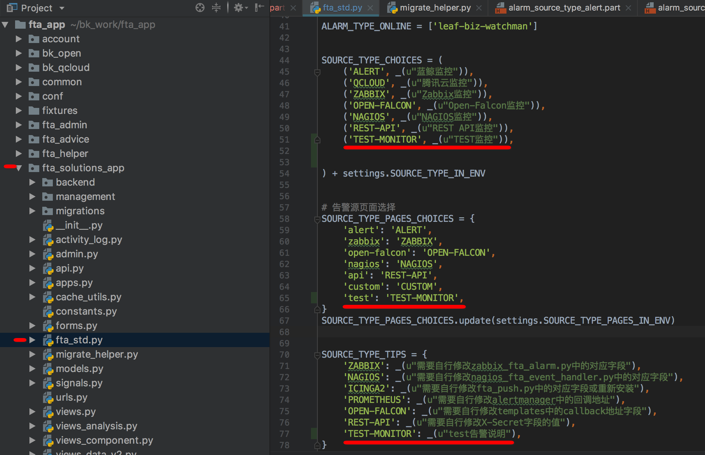

### 1.3 页面配置告警类型

#### 1.3.1 添加修改告警源页面的模版
在路径`${project_path}/templates/fta_solutions/alarm_source`下添加对的模版文件，可以开发自己需要的配置内容，可以参考所给资料代码 `code/alarm\_source\_test.part`
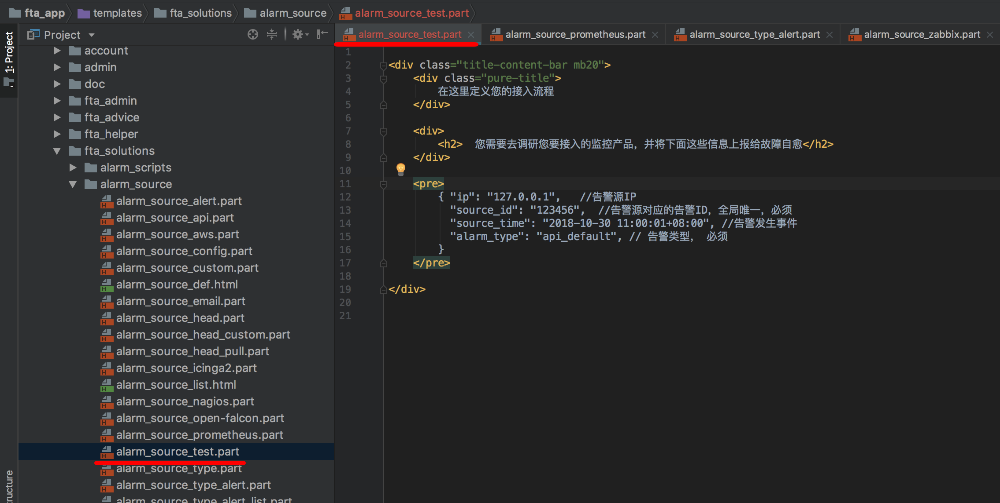

##### 1.3.2 自定义告警类型，让告警处理更加明确
在管理告警源中添加自定义类型, 规则匹配的内容为告警中的alarm_type字段
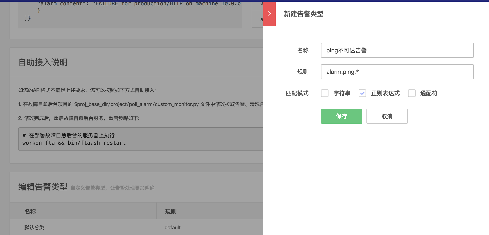

接入自愈的页面中可以选择自己配置的告警类型
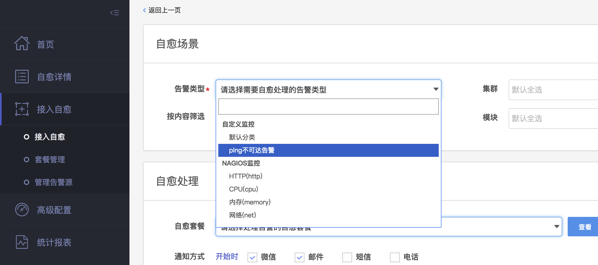

##### 1.3.3 代码初始化告警类型（可选，本次开发不做要求）
如果告警类型较多，也可以通过migrations或其他方式进行告警类型的初始化

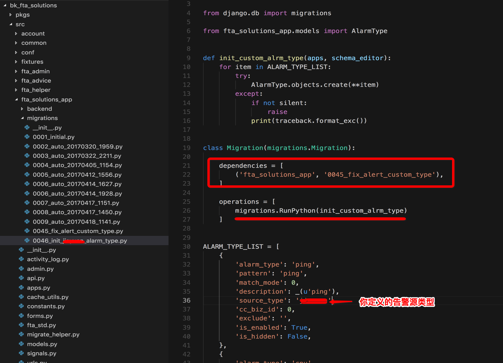

### 2. FTA后台开发流程

#### 2.1 推送类告警

##### 2.1.1 开发接收告警API接口
在目录`/fta/manager/www/apiservice/`下，添加对应的api文件，如下（可参考代码 code/test_api.py）：
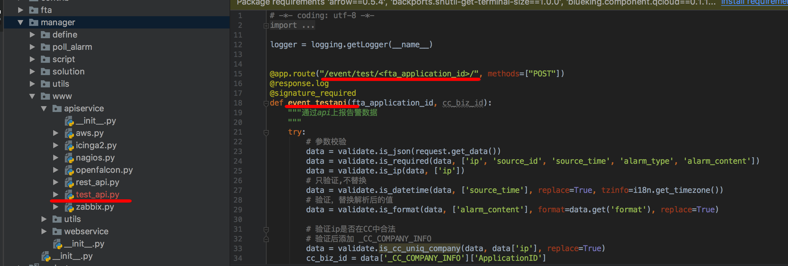

在这个页面中，注意根据告警源的配置的字段信息进行必要的配置，可参考 is\_required

##### 2.1.2 开发清洗数据代码
在目录`/fta/manager/poll_alarm/`添加文件，主要功能为清洗数据(可参考代码 `code/test_clean.py`)
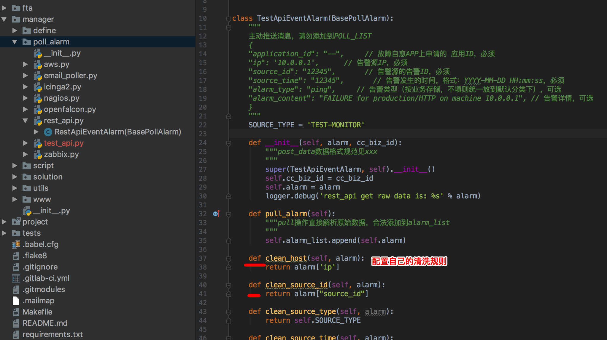

##### 2.1.3 重启后台进程
```
bash bin/fta.sh restart

```

##### 2.1.4 验证
**首先**，在接入自愈页面，根据步骤 `1.3.2` 配置的告警接入一个通知套餐
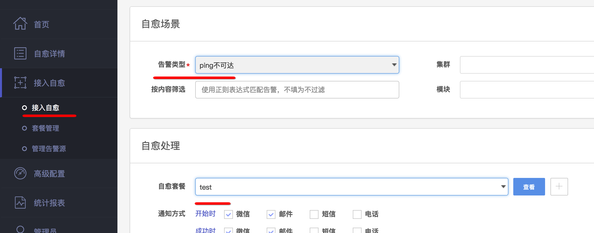

**然后**，模拟发出告警（根据自己的机器信息和告警类型修改对应的内容），如下图， 等待处理：
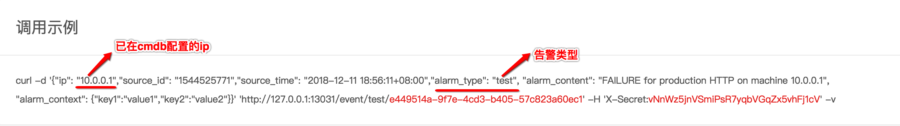
```bash

curl -d '{"inner_ip": "10.0.1.29","source_id": "1545040185","source_time": "2018-12-17 17:49:45+08:00","alarm_type": "test", "alarm_content": "FAILURE for production HTTP on machine 10.0.1.29", "alarm_context": {"key1":"value1","key2":"value2"}}' 'http://127.0.0.1:13031/event/test/2c4ee3f6-b769-4051-aef5-a5ba94ec290a/' -H 'X-Secret:5c5un03WqhlMI5ZLfoSVRQz3cK3sn1y9' -v

```

**最后**， 在自愈详情页面查看告警结果
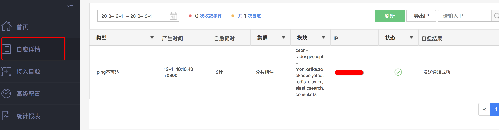


## 附件 -- 后台活动状态图
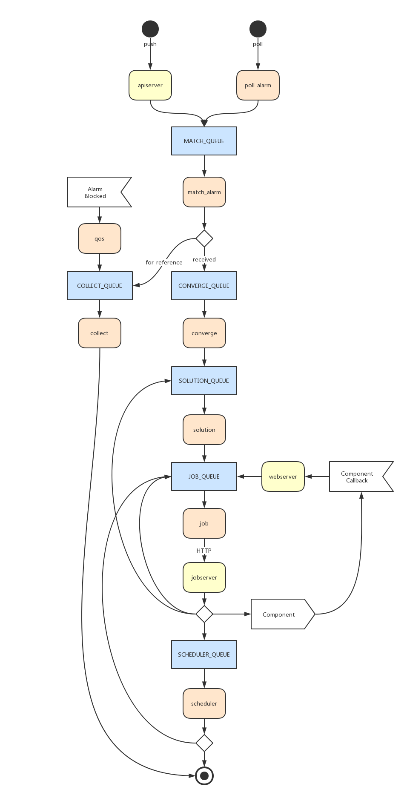


